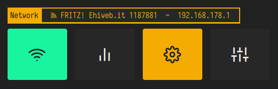

# General requirements

## Fonts
- Iosevka Nerd Font
- Feather
  
**Install**

run `./installfonts.sh`


## Icons
- Papirus
  
**Install**
[papirus-icon-theme](https://github.com/PapirusDevelopmentTeam/papirus-icon-theme)

`Arch Linux`
```
sudo pacman -S papirus-icon-theme
```

`Ubuntu/Debian`
```
sudo apt install papirus-icon-theme
```

# Colors

All color definitions are stored in `rasi/colors.rasi`.

# Position

Applet/menu positions can be changed in each script, in `SETTINGS`.

| Position  | on     | screen    |
|-----------|--------|-----------|
| northwest | north  | northeast |
| west      | center | east      |
| southwest | south  | southeast |

```
# SETTINGS ####################################################
# Possible positions:
# center
# north
# northeast
# east
# southeast
# south
# southwest
# west
# northwest
LOCATION="center"
###############################################################
```


# clock.sh


### Description
Largely derived from [adi1090x's Rofi collection](https://github.com/adi1090x/rofi) it's a simple clock applet.

### Config
Change applet position in the `SETTINGS`.


# layout.sh


### Description
This script has been designed explicitly for [LeftWM](https://github.com/leftwm/leftwm), so it won´t work with any other WM.

The top section will show the active LAYOUT in the focused screen.
The section below will select next or previous LAYOUT.

### Config

Change applet position in the `SETTINGS`.


# launcher.sh


### Description
A simple *drun-style* application launcher.

### Config
Change applet position in the `SETTINGS`.


# network.sh


### Description
Largely derived from [adi1090x's Rofi collection](https://github.com/adi1090x/rofi) it's a an applet to manage network connections.

The applet requires
- **bmon** ~ bandwidth monitor and rate estimator
- **nmtui** ~ Text User Interface for controlling NetworkManager
- **nm-connection-editor** ~ network connection editor for NetworkManager
- **alacritty/termite** to run bmon and nmtui

### Config
Change icons and applet position in the `SETTINGS`.


# powermenu.sh


### Description
Largely derived from [adi1090x's Rofi collection](https://github.com/adi1090x/rofi) it's a simple applet to control power actions like Shutdown, Reboot, Lock, Suspend and Logout.

The Lock option requires `/misc/lockscreen` script and
- **scrot** to take a screenshot of your workspaces
- - **imagemagick** to pixelate the screenshot
- **i3lock** to lock your system

### Config
Change icons and applet position in the `SETTINGS`.


# tags.sh


### Description
This script has been designed explicitly for [LeftWM](https://github.com/leftwm/leftwm), so it won´t work with any other WM.

The top section will show the active TAG in the focused screen.
The section below will show any other available TAG to switch to.

*Visible* or *Busy* TAGS can be marked with a special character or icon in the `SETTINGS`.

### Config

Each available TAG button will have the width configured in the `WIDTH` var.
Total window width will be calculated using `WIDTH` multiplied for the number of available TAGS (total tags minus the active one).

Busy marker can be set in `ISBUSY`.

Change applet position in the `SETTINGS`.


